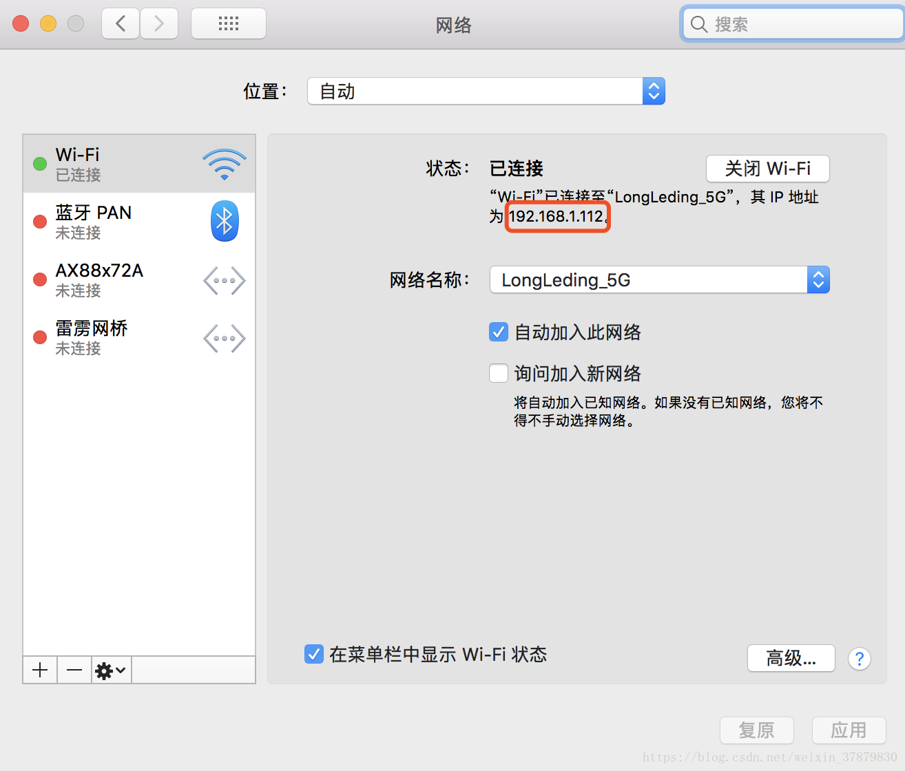

## 使用 Apache Bench 测试网站性能

- [Using Apache AB tool to test service performance in MAC environment | Develop Paper](https://developpaper.com/using-apache-ab-tool-to-test-service-performance-in-mac-environment/)
- [How to Use ApacheBench for Web Server Performance Testing | Datadog (datadoghq.com)](https://www.datadoghq.com/blog/apachebench/)

```
ab -n 200 -c 100 http://randoruf.github.io/
```

We can host a web application like WordPress, then use apache bench to test.

```
ab -n 200 -c 100 http://localhost/
```

Apache is very similar to Ningx, put all the shit to the ***web root directory*** , then Ningx will host a web application. 

## Mac上搭建Web服务器--Apache

- 来源 [ Mac上搭建Web服务器--Apache_最天使的博客-CSDN博客_mac web服务器](https://blog.csdn.net/weixin_37879830/article/details/82259102)

---

局域网搭建 Web 服务器测试环境,因为Mac OS X 自带了 [Apache](https://so.csdn.net/so/search?q=Apache&spm=1001.2101.3001.7020) 和 PHP 环境，我们只需要简单的启动它就行了。

1.命令：sudo apachectl start

Apache服务器默认的web[根目录](https://so.csdn.net/so/search?q=根目录&spm=1001.2101.3001.7020)在：`/Library/WebServer/Documents` 
Apache的配置文件在：`/etc/apache2`

相关命令：

停止 Apache：`sudo apachectl stop`

重启 Apache：`sudo apachectl restart`

2.浏览器输入：[http://localhost](http://localhost/)

3.将一个html文件拷贝到`/Library/WebServer/Documents` 文件夹下

4.浏览器中访问，测试文件名为test.html的文件，格式：本机IP/静态网页，http://192.168.1.112/test.html

查看IP地址：偏好设置-->网络



