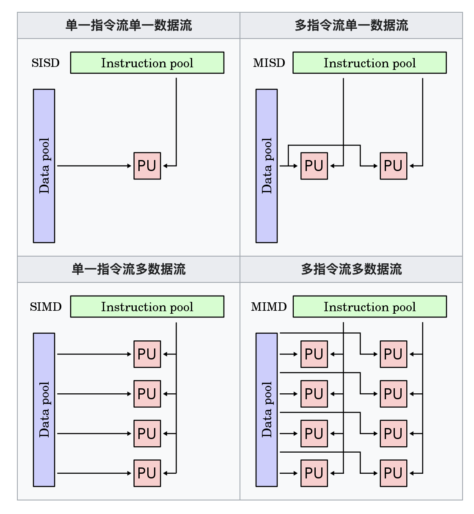
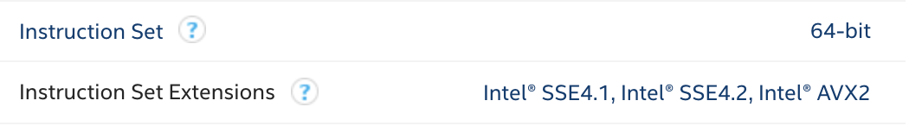
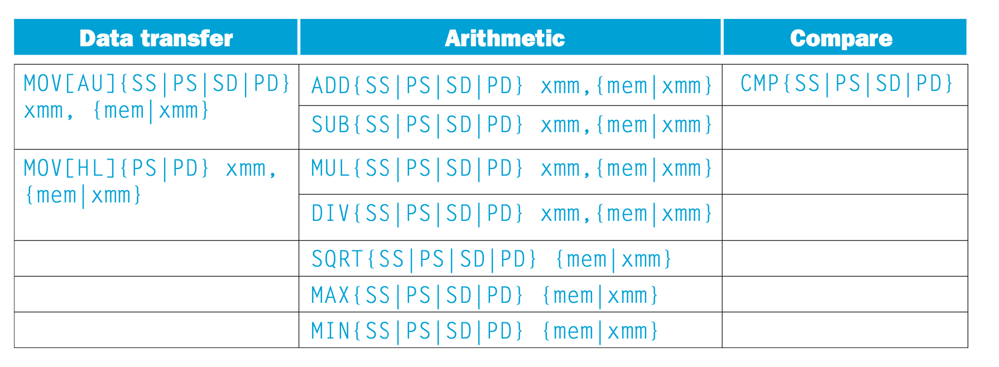
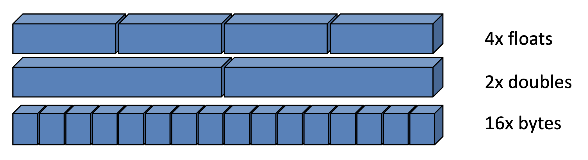
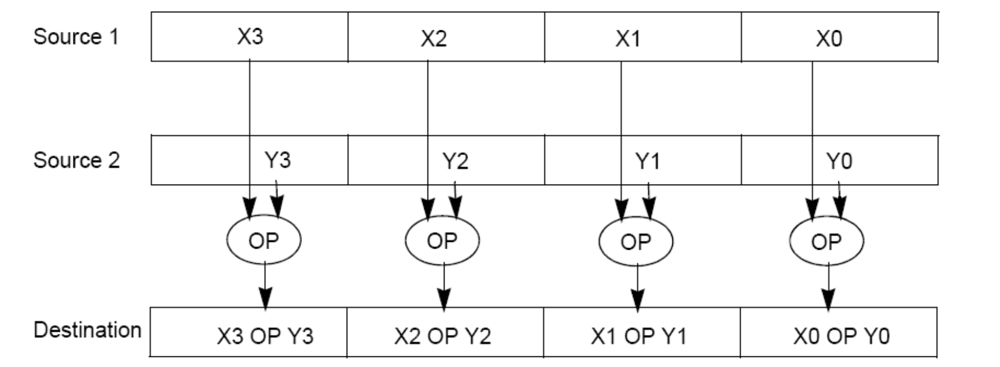

# SIMD for C++

## 参考资料

- Computer Organization and Design The Hardware Software Interface (RISC-V Edition) 
  - Chapter 3.7 
  - Chapter 6 
- [费林分类法 - 维基百科，自由的百科全书 (wikipedia.org)](https://zh.wikipedia.org/wiki/費林分類法)
- https://sites.cs.ucsb.edu/~tyang/class/240a17/slides/SIMD.pdf
- [Intrinsic function - Wikipedia](https://en.wikipedia.org/wiki/Intrinsic_function)
- [SIMD/Overview - MozillaWiki](https://wiki.mozilla.org/SIMD/Overview)
- https://ark.intel.com/content/www/us/en/ark/products/191045/intel-core-i79750h-processor-12m-cache-up-to-4-50-ghz.html 
- [ermig1979/Simd: C++ image processing and machine learning library with using of SIMD: SSE, AVX, AVX-512 for x86/x64, VMX(Altivec) and VSX(Power7) for PowerPC, NEON for ARM. (github.com)](https://github.com/ermig1979/Simd)
- [mendlin/SIMD-libgen: This is a toolkit called IDISA+ which could automatically generate SIMD libraries for SSE2/SSE3/SSSE3/SSE4.1/SSE4.2/AVX/NEON platforms. (github.com)](https://github.com/mendlin/SIMD-libgen)
- [CourSys - SIMD Code Generation in the LLVM Back-End (sfu.ca)](https://coursys.sfu.ca/2018sp-cmpt-489-x1/pages/BackEndSIMD)

## Flynn's Taxonomy

[Harvard architecture - Wikipedia](https://en.wikipedia.org/wiki/Harvard_architecture)

[费林分类法 - 维基百科，自由的百科全书 (wikipedia.org)](https://zh.wikipedia.org/wiki/費林分類法)

While modern computer systems are mostly based on Von Neumann architecture, Harvard architecture contrasts it by **distinguishing the instruction and data.** 

The Flynn's taxonomy is yet another classification of computer architectures, which may describe whether the computer will support vectorization and parallelism. 

**Instruction Pool**: a collection of instructions. 

**Data Pool**: a colletion of data streams.

Notice the difference between parallelism (并行) and concurrency (并发). 



### 如何查看是否支持 SIMD

查看 CPU 型号

```bash
sysctl -n machdep.cpu.brand_string
```

[Intel Ark](https://ark.intel.com) 可以查到所有 Product Specifications 。

比如 macbook pro 2019 款在 https://ark.intel.com/content/www/us/en/ark/products/191045/intel-core-i79750h-processor-12m-cache-up-to-4-50-ghz.html 



在 Instruction Set  那一栏可以看到 

- Instruction Set : 
  - An instruction set refers to **the basic set of commands and instructions that a microprocessor understands** and can carry out. 
  - [x64_cheatsheet.pdf (brown.edu)](https://cs.brown.edu/courses/cs033/docs/guides/x64_cheatsheet.pdf)
- Instruction Set Extensions: 
  - Instruction Set Extensions are additional instructions which can increase performance when the same operations are **performed on multiple data objects**. These can include **SSE (Streaming SIMD Extensions)** and **AVX (Advanced Vector Extensions)**.
  - [SSE](http://en.wikipedia.org/wiki/Sse2): Available on every not completely outdated CPU from Intel, AMD, or VIA. The SSE2 instructions are guaranteed to be available on all 64-bit x86-CPUs („x86-64“).
    - eight 128-bit registers, XMM0, XMM1, XMM2, XMM3, ... 
  - [AVX](http://en.wikipedia.org/wiki/Advanced_Vector_Extensions): Available on modern high-performance CPUs from Intel and AMD.

### Extended Instructions



From the book *Computer Organization and Design The Hardware Software Interface (RISC-V Edition)* by David A. Patterson and John L. Hennessy. 

The vector instructions are for **load/store**, **calculation** and **comparision**.   


### Scalar and Packed Data 

[SIMD/Overview - MozillaWiki](https://wiki.mozilla.org/SIMD/Overview)

In x64 architecture, there are sixteen **64-bit (or 8-byte) regsiters**. 

But SIMD usually works with **wider registers (e.g. 128-bit, 256-bit.. )** and SIMD can pack multiple data streams into a single data stream. A typical 128 bit SIMD register can contain...



(single precision floating point number 32 bit, double precision floating point number 64 bit). 

The vectorized instructions add and multiply are shown below 




There is a natural connecttion between **LLVM IR** and SIMD registers. 

[CourSys - SIMD Code Generation in the LLVM Back-End (sfu.ca)](https://coursys.sfu.ca/2018sp-cmpt-489-x1/pages/BackEndSIMD)

For example, `<4 x i32>` is the llvm vector type for a four 32-bit integers treated as a single (128-bit) value.


## 小作业 Homeworks 

[Image Processing - adjusting contrast of an image](./image-contrast/README.md)


## 大作业 Assignments 

