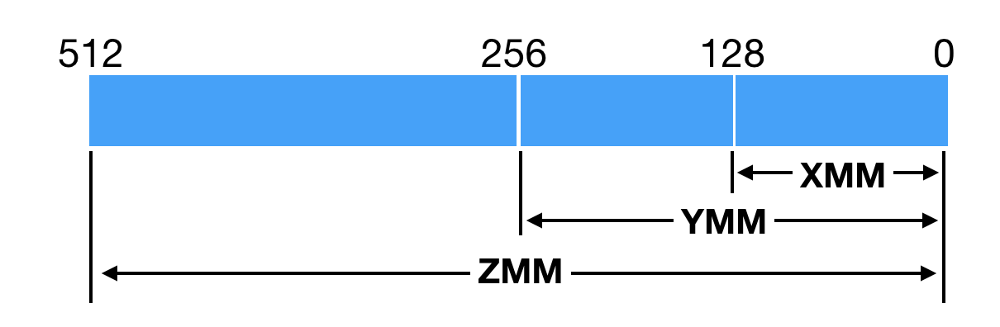

# SIMD for C++

## 参考资料

- Computer Organization and Design The Hardware Software Interface (RISC-V Edition) 
  - Chapter 3.7 
  - Chapter 6 
- [费林分类法 - 维基百科，自由的百科全书 (wikipedia.org)](https://zh.wikipedia.org/wiki/費林分類法)
- [从Eigen向量化谈内存对齐 - 知乎 (zhihu.com)](https://zhuanlan.zhihu.com/p/93824687)
- [Advanced Systems Lab - Spring 2021 (ethz.ch)](https://acl.inf.ethz.ch/teaching/fastcode/2021/)
- https://sites.cs.ucsb.edu/~tyang/class/240a17/slides/SIMD.pdf
- [Intrinsic function - Wikipedia](https://en.wikipedia.org/wiki/Intrinsic_function)
- [SIMD/Overview - MozillaWiki](https://wiki.mozilla.org/SIMD/Overview)
- [CourSys - SIMD Code Generation in the LLVM Back-End (sfu.ca)](https://coursys.sfu.ca/2018sp-cmpt-489-x1/pages/BackEndSIMD)

## Flynn's Taxonomy

[Harvard architecture - Wikipedia](https://en.wikipedia.org/wiki/Harvard_architecture)

[费林分类法 - 维基百科，自由的百科全书 (wikipedia.org)](https://zh.wikipedia.org/wiki/費林分類法)

While modern computer systems are mostly based on Von Neumann architecture, Harvard architecture contrasts it by **distinguishing the instruction and data.** 

The Flynn's taxonomy is yet another classification of computer architectures, which may describe whether the computer will support vectorization and parallelism. 

**Instruction Pool**: a collection of instructions. 

**Data Pool**: a colletion of data streams.

Notice the difference between parallelism (并行) and concurrency (并发). 


### Cheatsheet

- [x64_cheatsheet.pdf (brown.edu)](https://cs.brown.edu/courses/cs033/docs/guides/x64_cheatsheet.pdf)
- [LLVM Language Reference Manual — LLVM 15.0.0git documentation](https://llvm.org/docs/LangRef.html)
- [RISC-V Assembly Language (utk.edu)](https://web.eecs.utk.edu/~smarz1/courses/ece356/notes/assembly/)
- [RISCV_CARD.pdf (sfu.ca)](https://www.cs.sfu.ca/~ashriram/Courses/CS295/assets/notebooks/RISCV/RISCV_CARD.pdf)

### 如何查看是否支持 SIMD

查看 CPU 型号

```bash
sysctl -n machdep.cpu.brand_string
```

[Intel Ark](https://ark.intel.com) 可以查到所有 Product Specifications 。

比如 macbook pro 2019 款在 https://ark.intel.com/content/www/us/en/ark/products/191045/intel-core-i79750h-processor-12m-cache-up-to-4-50-ghz.html 


在 Instruction Set  那一栏可以看到 

- Instruction Set : 
  - An instruction set refers to **the basic set of commands and instructions that a microprocessor understands** and can carry out. 
- Instruction Set Extensions: 
  - Instruction Set Extensions are additional instructions which can increase performance when the same operations are **performed on multiple data objects**. These can include **SSE (Streaming SIMD Extensions)** and **AVX (Advanced Vector Extensions)**.
  - [SSE](http://en.wikipedia.org/wiki/Sse2): Available on every not completely outdated CPU from Intel, AMD, or VIA. The SSE2 instructions are guaranteed to be available on all 64-bit x86-CPUs („x86-64“).
    - eight 128-bit registers, XMM0, XMM1, XMM2, XMM3, ... 
  - [AVX](http://en.wikipedia.org/wiki/Advanced_Vector_Extensions): Available on modern high-performance CPUs from Intel and AMD.
    - In 2011, Intel enlarged the width of the registers, called YMM, in AVX (advanced vector extensions) .The YMM now is 256-bit instead of 128-bit (more floating-point operations)
    - To support legacy SSE instructions, the lower 128 bits of the YMM registers would be used as XMM. 
    - From SEE2 to AVX, prepend `v` and use YMM instead of XMM
      - SEE `addpd %xmm0,%xmm4`  (SEE addition on registers `xmm0` and `xmm4` with packed `double` data)
      - AVX `vaddpd %ymm0, %ymm4` (AVX addition on registers `ymm0` and `ymm4` with packed `double` data)
    - AVX 512 bits `zmm`, 1024 bits in the later x86 architecture..... 
  - Three and four address instructions 
    - Three address in AVX: `vaddpd %ymm0, %ymm1, %ymm4` 
      - `%ymm4 = %ymm0 + %ymm1`   
    - Four address in SEE:  `addpd %xmm0, %xmm4`
      - `%xmm4 = %xmm4 + %xmm0` (add source to destination) 
    - *Three address instrucions* are common in LLVM IR, but the arrangment is a bit different from X86 instruction set 
      - [LLVM IR](https://llvm.org/docs/LangRef.html) `<add4> = add <ty> <add0> <add1>` 
      - [RISC-V](https://web.eecs.utk.edu/~smarz1/courses/ece356/notes/assembly/) `add <add4> <add0> <add1>` 
      - X86 AVX  `vaddpd %ymm0, %ymm1, %ymm4 ` 

### SEE2 Extended Instructions

A few extended instructions are in SEE2 CPU. 


From the book *Computer Organization and Design The Hardware Software Interface (RISC-V Edition)* by David A. Patterson and John L. Hennessy. 

The vector instructions are for **load/store**, **calculation** and **comparision**.   

### Scalar Data

one operand in a normal/wider register. 

- one 32-bit operand in a 128-bit SEE register 
- one 64-bit operand in a 128-bit SEE register 

### Packed Data 

[SIMD/Overview - MozillaWiki](https://wiki.mozilla.org/SIMD/Overview)

In x64 architecture, there are sixteen **64-bit (or 8-byte) regsiters**. 

But SIMD usually works with **wider registers (e.g. 128-bit, 256-bit.. )** and SIMD can pack multiple data streams into a single data stream. A typical 128 bit SIMD register can contain...

> If the operands can be arranged in memory ***as 128-bit aligned data***, then ***128-bit data transfers can load and store multiple operands per instruction.***
>
> ___from the book Chapter 3.7 *Computer Organization and Design: the hardware and software interface (RISCV edition)*


(single precision floating point number 32 bit, double precision floating point number 64 bit). 

The vectorized instructions add and multiply are shown below 


There is a natural connecttion between **LLVM IR** and SIMD registers. 

[CourSys - SIMD Code Generation in the LLVM Back-End (sfu.ca)](https://coursys.sfu.ca/2018sp-cmpt-489-x1/pages/BackEndSIMD)

For example, `<4 x i32>` is the llvm vector type for a four 32-bit integers treated as a single (128-bit) value.

### Intrinsics

Intrinsics are C functions and procedures for ***inserting assembly language into C code***, including SSE instructions. 

[Header files for x86 SIMD intrinsics - Stack Overflow](https://stackoverflow.com/questions/11228855/header-files-for-x86-simd-intrinsics)

> These days you should normally just include `<immintrin.h>`. It includes everything.

```cpp
#include <mmintrin.h>  // MMX
#include <xmmintrin.h> // SSE
#include <emmintrin.h> // SSE2
#include <pmmintrin.h> // SSE3
#include <tmmintrin.h> // SSSE3
#incldue <smmintrin.h> // SSE4.1
#include <nmmintrin.h> // SSE4.2
#include <ammintrin.h> // SSE4A
#include <wmmintrin.h> // AES
// ----------------------------------------------
#include <immintrin.h> // AVX, AVX2, FMA (note that AVX is compatible to SEE). 
```

The **intrinsic** development guide in Intel: 
https://www.intel.com/content/www/us/en/docs/intrinsics-guide/index.html

(这个 Intel 手册还挺漂亮的)。

[How to Write Fast Numerical Code (ethz.ch)](https://acl.inf.ethz.ch/teaching/fastcode/2021/slides/07-simd-avx.pdf)

### Memory and Alignment 

[从Eigen向量化谈内存对齐 - 知乎 (zhihu.com)](https://zhuanlan.zhihu.com/p/93824687)

[深入拆解 Java 虚拟机 (doc.vercel.app)](https://doc.vercel.app/jvm/article/39838.html)

[Alignment | Microsoft Docs](https://docs.microsoft.com/en-us/cpp/cpp/alignment-cpp-declarations?view=msvc-170)

The data are identified by their addresses in memory.

An address is said to be aligned to `X` if its alignment is `Xn+0`.

A single datum also has a size. **We call a datum *naturally aligned* if its address is aligned to its size.**

For example, an 8-byte floating-point datum is naturally aligned if the address used to identify it has an 8-byte alignment.


X86_64体系架构上**通用寄存器的大小为64位（即8个字节）**。

所谓的XMM寄存器，是由SSE（Streaming SIMD Extensions）指令集所引入的。它们一开始仅为128位。自从X86平台上的CPU开始支持AVX（Advanced Vector Extensions）指令集后（2011年），XMM寄存器便升级为256位，并更名为YMM寄存器。**原本使用XMM寄存器的指令，现将使用YMM寄存器的低128位。**

由于 vectorization 需要把整一段连续的内存读进 Register 里面， 所以需要内存对齐。



注意到内存地址如果以**16进制表示**。如果要求32位对齐，只需要看**倒数第二位是否是偶数** (有没有多出一个16)。

内存对齐需要**首地址是32的倍数**其**连续的区域** (可以通过 `sizeof(__m256)/sizeof(double)` 判断可以连续处理多少个)。


#### Compiler-time Memory Alignment 

[从Eigen向量化谈内存对齐 - 知乎 (zhihu.com)](https://zhuanlan.zhihu.com/p/93824687)

Intrinsic function 是属于预编译指令，只能在 compile-time 时进行内存对齐。

所以需要保证 `__attribute__ ((aligned (32)))` 必须在 Stack 数据声明 (因为 Stack 在编译时就能被确定，其内存地址也在编译时被确定)

但是如果在 `new` 对象时，其数据是储存在 Heap 上。C++的运行时库并不会关心预编译指令声明的对齐方式。

#### Runtime Memory Alignment 

[从Eigen向量化谈内存对齐 - 知乎 (zhihu.com)](https://zhuanlan.zhihu.com/p/93824687)


## ABI 

To check whether the system support SSE, AVX 

```bash
sysctl -a | grep machdep.cpu.features
```

and it returns. 

```
FPU VME DE PSE TSC MSR PAE MCE CX8 APIC SEP MTRR PGE MCA CMOV PAT PSE36 CLFSH DS ACPI MMX FXSR SSE SSE2 SS HTT TM PBE SSE3 PCLMULQDQ DTES64 MON DSCPL VMX EST TM2 SSSE3 FMA CX16 TPR PDCM SSE4.1 SSE4.2 x2APIC MOVBE POPCNT AES PCID XSAVE OSXSAVE SEGLIM64 TSCTMR AVX1.0 RDRAND F16C
```

To enable AVX in ABI, we need some flags

```
clang++ main.cpp -mavx -mavx2
```

问题 

- [ ] TODO: 什么是 ABI ？？？


## 小作业 Homeworks 

- [x] [Hello World (unrolling, SIMD)](./hello-world/README.md)
- [ ] [Shuffle the Array - LeetCode](https://leetcode.com/problems/shuffle-the-array/)
- [ ] [Kids With the Greatest Number of Candies - LeetCode](https://leetcode.com/problems/kids-with-the-greatest-number-of-candies/)
- [ ] [Minimum Number of People to Teach - LeetCode](https://leetcode.com/problems/minimum-number-of-people-to-teach/)
- [ ] [Median of Two Sorted Arrays - LeetCode](https://leetcode.com/problems/median-of-two-sorted-arrays/)

## 大作业 Assignments 

了解 BMP 格式 (BMP is the simplest photo format, it is easy to implement a BMP header library).   

- [ ] [BMP Image Processing - adjusting contrast of an image](./image-contrast/README.md) 

完成 ETH Advanced System Lab 的科研题目。

- [ ] [Advanced Systems Lab - Spring 2021 (ethz.ch)](https://acl.inf.ethz.ch/teaching/fastcode/2021/)

## 项目 Projects 

参考以下线性代数的库了解 SIMD 的实际用途以及学习正确的线性代数，单继承组合等等的设计 (Ruby 是倡导单继承的)。

- [ ] [Ubpa/UGM: Ubpa Graphics Mathematics (github.com)](https://github.com/Ubpa/UGM)
- [ ] [Eigen的速度为什么这么快？ - 知乎 (zhihu.com)](https://www.zhihu.com/question/28571059)
- [ ] [ermig1979/Simd: C++ image processing and machine learning library with using of SIMD: SSE, AVX, AVX-512 for x86/x64, VMX(Altivec) and VSX(Power7) for PowerPC, NEON for ARM. (github.com)](https://github.com/ermig1979/Simd)
