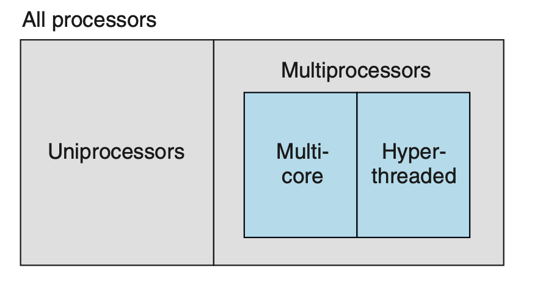
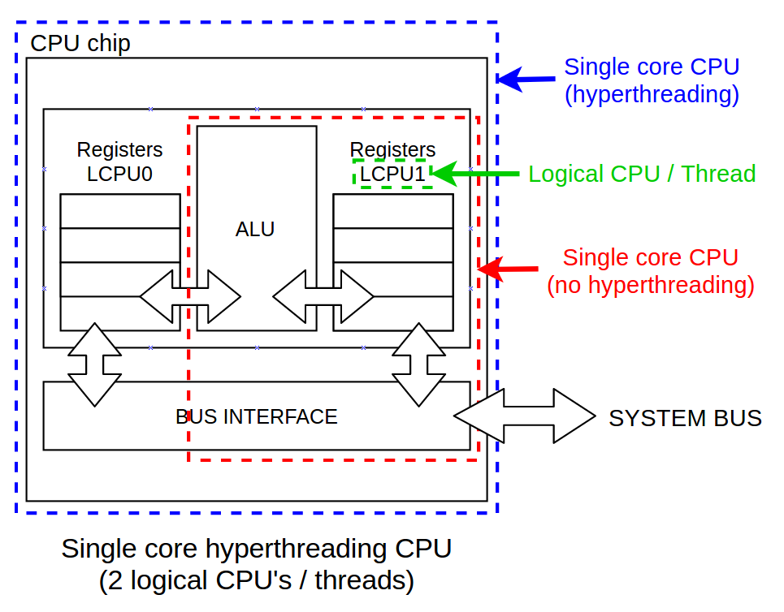
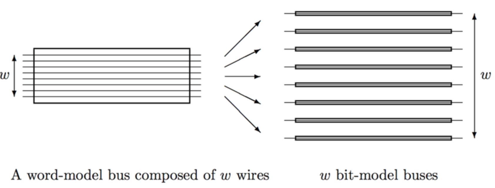
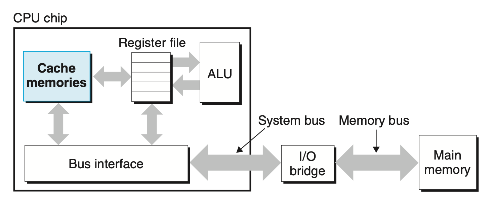
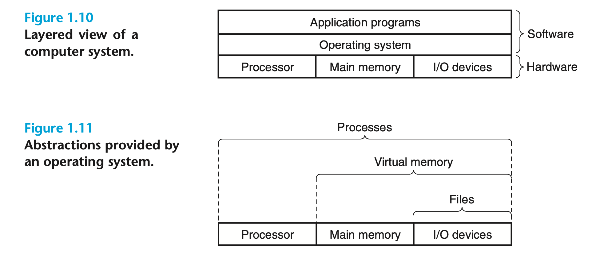
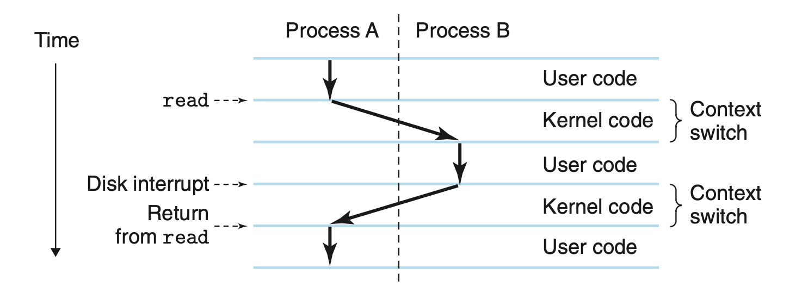
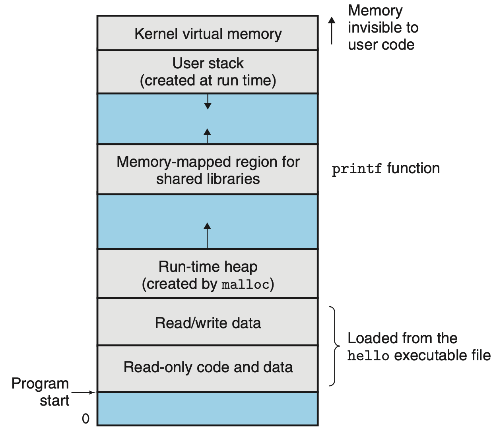

# A Tour of Computer Systems

疑问

- `switch` 和 `if` 哪个更快?
- how much overhead is incurred by function call 
- `while` 和 `for` loop 哪个更快?
- pointer reference 和 array indexes 哪个快？
- Chapter 5 
  - Why does our loop run so much faster if we sum into a local variable instead of an argument that is passed by reference?
  - How can a function run faster when we simply rearrange **the parentheses in an arithmetic expression?** 
-  Chapter 7 
  - what does it mean when **the linker reports** that it cannot resolve a reference?
  - What is the difference between a **static variable** and a global variable? 
  - What happens if you define **two global variables** in different C files with the same name?
  - What is the difference between **a static library and a dynamic library**?
  - Why does it matter what order we **list libraries on the command line**?
  - And scariest of all, **why do some linker-related errors not appear until run time?** 
- Chapter 3
  - *buffer overflow vulnerabilities* have accounted for many of the security holes in network and Internet servers.
  -  stack discipline and buffer overflow vulnerabilities

---

- 了解 Amdahl’s Law 
- 了解 Concurrency and Parallelism
- 了解 thread-level concurrency 
  - 了解 multi-core 结构 和 hyper-threaded 
    - 超线程如何 **a core executing two threads** (**一个核心里有两份 PC 和 register files**， 其他资源共享)
  - 即使两个核心，也可以是  thread-level concurrency 。因为 **一个 core 只能每次执行一个 instruction** (其实可能更糟糕，比如3-10个cycle 才能执行完一个 instruction。后面有**流水线**的概念)
- 了解 Instruction-Level Parallelism
  - *pipelining*: 
    - The stages can operate in parallel, **working on different parts of different instructions.** 
- 了解 Single-Instruction, Multiple-Data (SIMD) Parallelism
- 了解 Abstractions
  - 了解 application program interface (API) ，Java class declarations 和 C function prototypes.
  - 了解 virtual machine 

[Differences between physical CPU vs logical CPU vs Core vs Thread vs Socket | daniloaz.com](https://www.daniloaz.com/en/differences-between-physical-cpu-vs-logical-cpu-vs-core-vs-thread-vs-socket/)

---

- 了解信息的本质 = bits + context 

  - 了解信息的基本大小 bit 和 bytes (bytes = 8 bits chunks)
  - 了解 ASCII characters 

- 了解编译过程

  - Preprocessing 和 directives 
  - Compilaition 和 Assembly-language program
  - Assembly phase 和 *relocatable object program* `.o`
  - Linking phase 和 object files `.o`

- 了解 hardware ogranization 

  - (除了 ALU 还有 FLU 哦)

  - **Buses**:  a collection of electrical **conduits** that carry bytes of information back and forth between the components. 

    - The minimum fixed-size chunks in buses is known as ***word*** (transferring in parallel). Most machines today have word sizes of either 4 bytes (32 bits) or 8 bytes (64 bits)

      

  - **I/O Devices**: Each I/O device is connected to the I/O bus by either a *controller* or an *adapter*. 

    - Controllers are chip sets in the device itself or the *motherboard*.
    - An adapter is a card that plugs into a slot on the motherboard.

  - **Main Memory**: a collection of *dynamic random access memory* (DRAM) chips.

    - memory is organized as **a linear array of bytes**, each with its own unique address (array index) starting at zero.

  - **Processor**: The *central processing unit* (CPU), or simply *processor*, is the engine that inter- prets (or *executes*) instructions stored in main memory.

    - The **register file** is a small storage device that consists of a collection of **word-size registers**

    - Program Counter 

      - At its core is a **word-size** storage device (or *register*) called the ***program counter* (PC)**. 
      - At any point in time, **the PC points at (contains the address of) some machine-language instruction in main memory**. 

    - *instruction set architecture*: instruction execution model

      - which describes that executing a single instruction involves performing a series of steps.
      - The processor reads the instruction from memory pointed at by the **program counter (PC)**, **interprets** the bits in the instruction, **performs some simple operation** dictated by the instruction, and then **updates the PC** to point to the next instruction
      - *arithmetic/logic unit* (ALU) only involves register files. 

    - operations: 

      - **Load**: Copy a **byte** or a **word** from **main memory** into a register
      - **Store**:  Copy a **byte** or a **word** from a **register** to a location in main memory,
      - ***Operate***: Copy the contents of two registers to the ALU, perform an arithmetic operation on the two words,  and store the result in a register,
      - ***Jump***: Extract a **word** from **the instruction itself** and **copy that word into the program counter (PC)**

    - **Caches**: L1, L2, L3 caches which are *static random access memory* (SRAM)

       

  - **DMA**: Using a technique known as *direct memory access* (DMA, discussed in Chap- ter 6), the data travel directly **from disk to main memory,**

- 了解 Operating system 的抽象

  - **Files**: A *file* is a sequence of bytes, nothing more and nothing less.

    - Every I/O device, including *disks*, *keyboards*, *displays*, and even *networks*, is modeled as a file.
    - All input and output in the system is performed by reading and writing files, using a small set of system calls known as *Unix I/O*.

  - **Network**: 

    -  When the system copies a sequence of bytes from main memory to the network adapter, the data flow across the network to another machine. 

  - 看起来是**进程**在**独享所有资源** each process appears to have exclusive use of the hardware

    

  -  By ***concurrently***, we mean that the instruc- tions of one process are **interleaved** with the instructions of another process.

    - The operating system performs this interleaving with a mechanism known as ***context switching***

  - ***context***:  all the state information that the process needs in order to run

    - current values of the **PC**, the **register file**, and the **contents of main memory (process control unit).** 

  - ***context switching*** : the transition from one process to another is man- aged by the operating system *kernel*.

    

    - The **kernel** is the portion of the operating system code that is **always resident in memory.**''
    - When an application program requires some action by the operating system, it executes a special *system call* instruction, **transferring control to the kernel.**
    - Note that the kernel is not a separate process. Instead, it is a collection of code and data structures that the system uses to manage all the processes.

  - **Threads**: execution units running in the context of the process and sharing the same code and global data.

  - **Virtual Memory** 

    - Each process has the same uniform view of memory, which is known as its *virtual address space*.
    - The virtual address space for Linux processes is shown below 
    - 
    - In Linux, **the topmost region of the address space** is reserved for code and data in the operating system that is common to all processes. 
    - The lower region of the address space holds the code and data defined by the user’s process.

