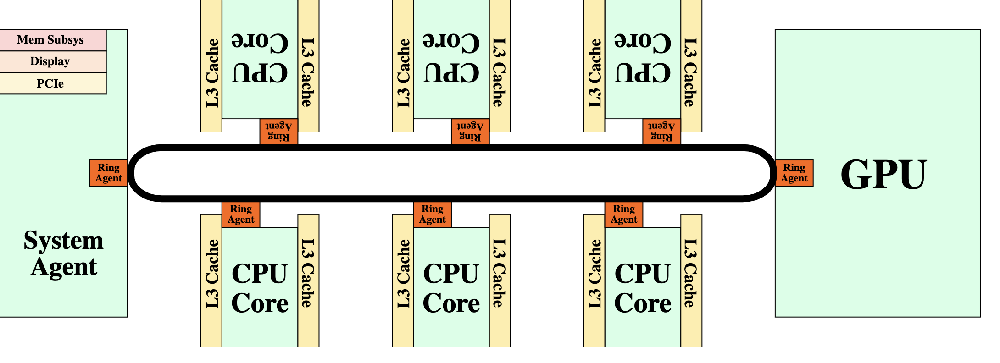
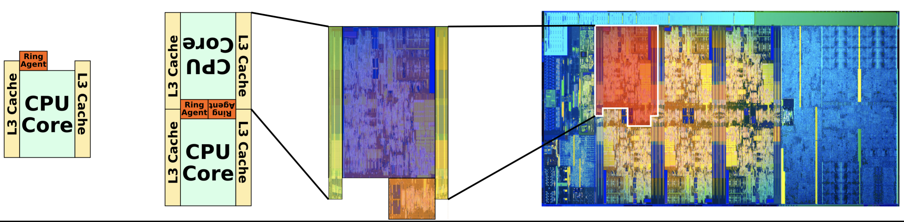
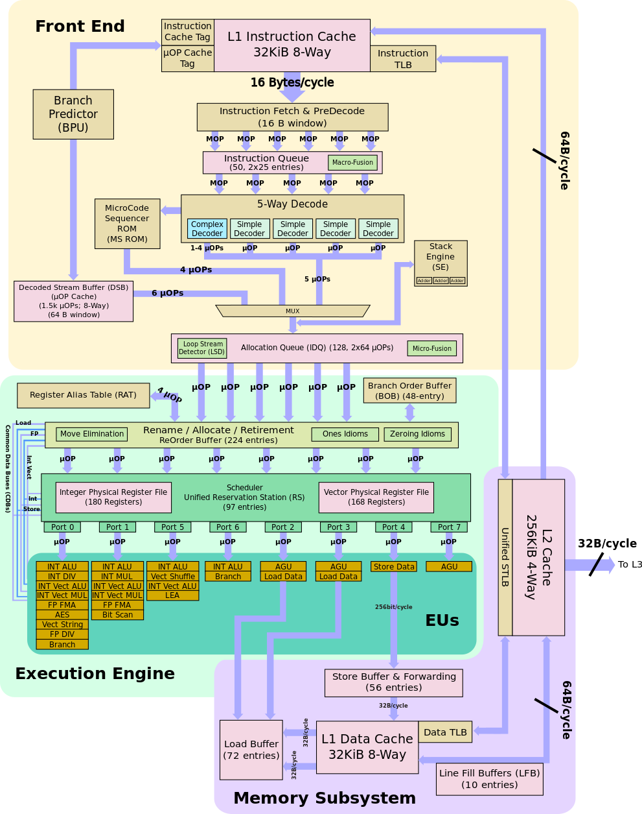

# Intel Coffee Lake 

From the **WikiChip** [Coffee Lake - Microarchitectures - Intel - WikiChip](https://en.wikichip.org/wiki/intel/microarchitectures/coffee_lake)

## Overview 

[Coffee Lake - Microarchitectures - Intel - WikiChip](https://en.wikichip.org/wiki/intel/microarchitectures/coffee_lake#Overview)

There are 5 major components: **CPU cores**, LLC, Ring interconnection, System Agent, integrated graphics. 

## Historical Trend 

[Coffee Lake - Microarchitectures - Intel - WikiChip](https://en.wikichip.org/wiki/intel/microarchitectures/coffee_lake#Historical_Trend)

- 2006 年胶水四核 (Dual Core 双核是真的)
- 2008 年 Hehalem 
- 2011 年 Sandy Bridge 引入 环形总线
- 2017 年 基于 Sandy Bridge 双环形总线？

### SoC Block Diagram 

hexa

### Individual Core

Each core 

