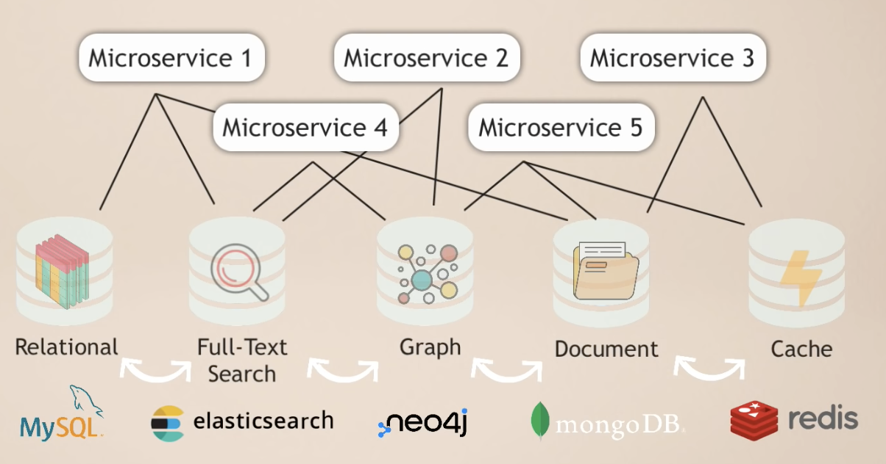

## Database 

### Database != MySQL

[Redis Crash Course - the What, Why and How to use Redis as your primary database - YouTube](https://www.youtube.com/watch?v=OqCK95AS-YE)

每种 Database Paradigm 都有其局限性，所以最常见的情况是，多种 Database 一起使用。

比如现在设计一个 **推特** (*Microservice* 结构)， 可能需要的 databse 就有

- **Relational**: MySQL 用户数据
- **Full-text Search**:  elasticsearch 搜索
- **Graph**: neo4j 表示用户之间的关联
- **Document**: mongoDB 图片、视频等
- **Cache**: redis 基于 CPU 的 Cache 理念，缓存其他数据库，加快速度。

其中最重要的是 ***Redis*** (支持多种 data format)，详情看

 