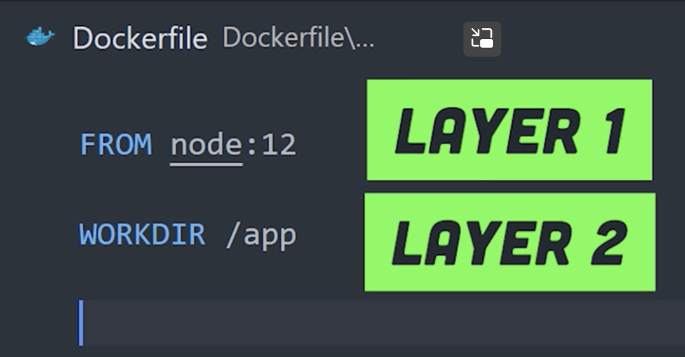

# Docker 101 

[前言 - Docker — 从入门到实践 (gitbook.io)](https://yeasy.gitbook.io/docker_practice/)

类比

- Dockerfile = 源代码
- Image = 可执行程序 (可以通过继承和叠加，生成新的 Image)
- Container = 进程实例 (创建、启动、停止、删除、暂停)

## Image & Layers 

[Docker 镜像 | Docker 从入门到实践 (docker-practice.com)](https://vuepress.mirror.docker-practice.com/basic_concept/image/)

> 镜像构建时，会一层层构建，前一层是后一层的基础。每一层构建完就不会再发生改变，后一层上的任何改变只发生在自己这一层。比如，删除前一层文件的操作，实际不是真的删除前一层的文件，而是仅在当前层标记为该文件已删除。在最终容器运行的时候，虽然不会看到这个文件，但是实际上该文件会一直跟随镜像。***因此，在构建镜像的时候，需要额外小心，每一层尽量只包含该层需要添加的东西，任何额外的东西应该在该层构建结束前清理掉。***

https://youtu.be/gAkwW2tuIqE?t=248

> ***Every instruction in the docker is a layer.*** 



> ***Docker will cache layer if nothing is actually changed.*** 
>
> A better way is to ***install all dependencies at first.*** 
>
> 类似 CPU 的 Cache 机制，只要不变就驻存在内存中，加快速度。

**关于 `RUN` 和 `CMD ` 的区别**

- `RUN` 会启动 Shell session (`RUN ["echo", "'Hello World'"]`)
- `CMD` 不会启动 Shell session (但是全局只能有一个)

### 为什么使用层结构?

类似 Git Commit 的概念 [利用 commit 理解镜像构成 | Docker 从入门到实践 (docker-practice.com)](https://vuepress.mirror.docker-practice.com/image/commit/)

没有必要真的把所有修改都记录下来。

***只需要记录被修改的部分***，这样可以减小镜像空间。

可以使用 `docker commit`, `docker diff` , `docker history`

> 使用 `docker commit` 命令虽然可以比较直观的帮助理解镜像分层存储的概念，但是实际环境中并不会这样使用。
>
> 此外，使用 `docker commit` 意味着所有对镜像的操作都是黑箱操作，生成的镜像也被称为 **黑箱镜像**，换句话说，就是除了制作镜像的人知道执行过什么命令、怎么生成的镜像，别人根本无从得知。

可以使用 Dockerfile 对基础镜像进行**继承、修改**。

### Docker Registry

每个仓库的全程是 `User/Rep:Tag`

可以理解 `User` 为发行商，`Rep` 就是软件名，`Tag` 就是软件版本。

```bash
docker pull [选项] [Docker Registry 地址[:端口号]/]<用户名>/<软件名>[:标签]
```

We could also choose different Docker Registry (for example, differnt mirror of docker registry). 

### Dockerfile

注意 Docker 并不是虚拟机。

> *Union FS 是有最大层数限制的，比如 AUFS，曾经是最大不得超过 42 层，现在是不得超过 127 层。*
>
> https://vuepress.mirror.docker-practice.com/image/build/#run-%E6%89%A7%E8%A1%8C%E5%91%BD%E4%BB%A4

详细看 [dockerfile.md](./dockerfile.md)

## Container

It is not hard, but we must be able to distinguish what is terminal, tty, shell and kernel before diving into docker. 

Read https://github.com/randoruf/cs-nano-projects/tree/main/linux101/README.md 

and  https://github.com/randoruf/cs-nano-projects/blob/main/docker101/os-linux/README.md

and https://github.com/randoruf/cs-nano-projects/blob/main/docker101/example-mosh-js/README.md

> 每一个容器运行时，是以镜像为基础层，在其上创建一个当前容器的存储层，我们可以称这个为容器运行时读写而准备的存储层为 **容器存储层**。

> 按照 Docker 最佳实践的要求，容器不应该向其存储层内写入任何数据，**容器存储层要保持无状态化**。所有的文件写入操作，都应该使用 [数据卷（Volume）](https://vuepress.mirror.docker-practice.com/data_management/volume.html)、或者 [绑定宿主目录](https://vuepress.mirror.docker-practice.com/data_management/bind-mounts.html)，在这些位置的读写会跳过容器存储层，直接对宿主（或网络存储）发生读写，其性能和稳定性更高。

Also see [Linux namespace.md](./namespace.md)

## Other

[Docker run reference | Docker Documentation](https://docs.docker.com/engine/reference/run/)

### Docker Image 

#### docker image list

[列出镜像 | Docker 从入门到实践 (docker-practice.com)](https://vuepress.mirror.docker-practice.com/image/list/#列出部分镜像)

了解一下 “中间镜像”

#### docker image delete 

[删除本地镜像 | Docker 从入门到实践 (docker-practice.com)](https://vuepress.mirror.docker-practice.com/image/rm/#)

一个镜像可能会有**多个标签**，但是 ID 是唯一的。如果删除的仅仅只是标签，可能会有 Untagged 而不是 Deleted 行为。

了解 shell 的连续求值

```bash
docker image rm $(docker image ls -q redis)
```

