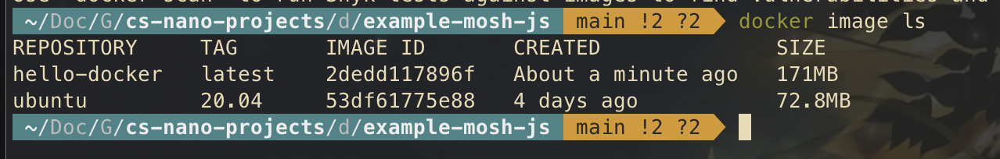

# Hello Docker - Build an Image

## Recommanded Readings 

[【Programming with Mosh】Docker Tutorial for Beginners - YouTube](https://www.youtube.com/watch?v=pTFZFxd4hOI)

https://github.com/randoruf/cs-nano-projects/tree/main/docker101/os-linux

## Code 

Give execution premission to `run.sh` and run it

(the script `run.sh` is for macOS, you may change the first line to `#!/bin/bash` if you are using Linux). 

```bash
chmod +x run.sh 
./run.sh
```

and see whether the image is built. 

```
docker image ls
```



Run our image as a container 

```bash
docker run hello-docker 
```

