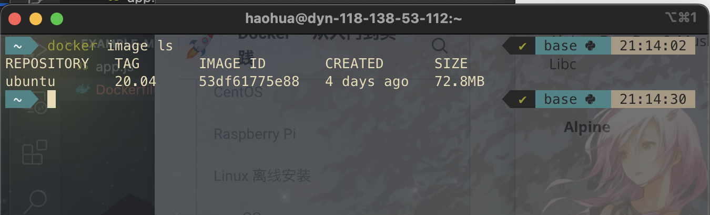
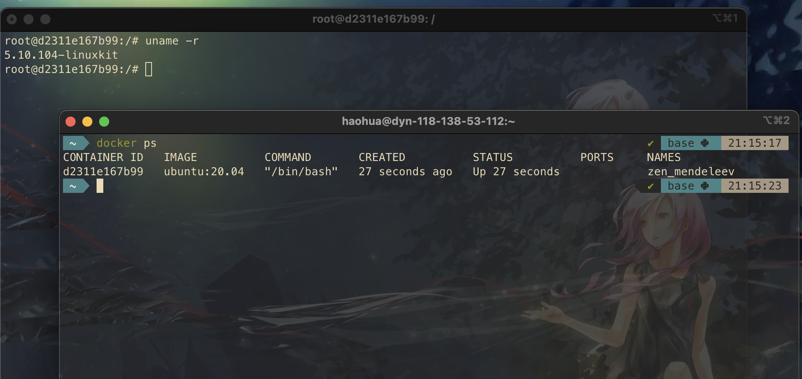

# 实战案例 - Linux 操作系统

[Alpine - Docker — 从入门到实践 (gitbook.io)](https://yeasy.gitbook.io/docker_practice/os/alpine)

本文介绍如何获得一个纯净 Linux Image 然后运行 Container. 

## Linux 

See https://github.com/randoruf/cs-nano-projects/tree/main/linux101

Download the Ubuntu image 

```bash
docker pull ubuntu:20.04
```

And check out the images 

```
docker image ls
```



To launch the Ubuntu container 

```bash
docker run -ti ubuntu:20.04 /bin/bash
```

(`t` means termianl or tty, and `i` means interative mode. Then `/bin/bash` is the first prorgam to run after entering Ubuntu)

If you open another terminal and type `docker ps`, you will inmediately know ***what is a container***.

The container is a running instance/process of an image. 



To exit the sesstion, type `exit` or press ***ctrl+d*** (***ctrl + c*** to interrupt the sesstion). 

Now check again by typing `docker ps`, and see what container we have. 

> We could remove the container by `docker rm`

## Alpine, BusyBox & Musl Libc 

> 使用 Docker，读者只需要一个命令就能快速获取一个 Linux 发行版镜像。

### BusyBox

类似于 MinGW. It incorporates about a hundred of the most used ***Linux Utilities*** (aka, tools and commands like `cat`, `echo`, `grep`, `mount`, `telnet`). 

The beauty of it is that it supports any kind of Operating Systems which respect ***POSIX*** (Linux, Android, FreeBSD).

 It is a great way to learn Linux !

### Alpine

A light-weight Linux Distribution (aka. the modified copy of Linux. the original Linux is so-called upstream). 

Alpine Linux uses **musl libc**  and **busybox** to reduce its size (compared to Ubuntu, even Ubuntu Server will occupy around 1 GB).

Alpine also has its own package manager `apk`. 

Docker now starts to recommend Alpine instead of Ubuntu 

```
REPOSITORY          TAG           IMAGE ID          VIRTUAL SIZE
alpine              latest        4e38e38c8ce0      4.799 MB
debian              latest        4d6ce913b130      84.98 MB
ubuntu              latest        b39b81afc8ca      188.3 MB
centos              latest        8efe422e6104      210 MB
```

From the book [《docker 从入门到实践》](https://yeasy.gitbook.io/docker_practice/)

