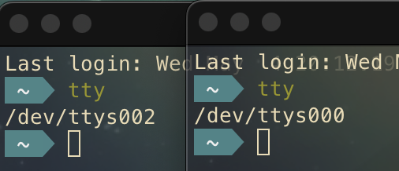
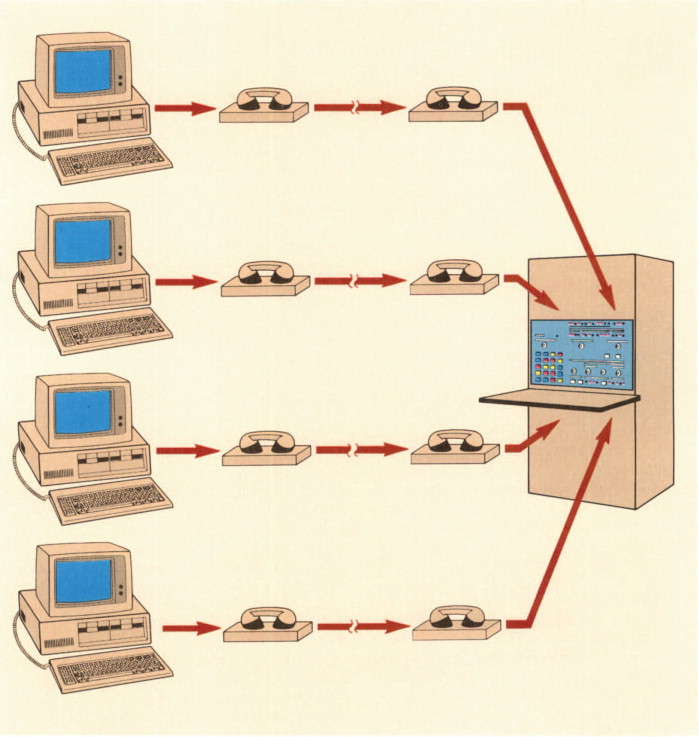

# Linux 101

蓝桥 Linux 入门

## Basics 

### Terminal/Console = Typewriter

[Terminals, Consoles & Shells Explained... - Sab's Blog (sebastiangogola.com)](https://sebastiangogola.com/terminals-consoles-shells-explained/)

**A teleprinter (teletypewriter, *teletype* or TTY)** is an electromechanical device that can be used to send and receive messages. 

  

From [Using a 1930 Teletype as a Linux Terminal - YouTube](https://www.youtube.com/watch?v=2XLZ4Z8LpEE)

That is what `tty` stands for. 

> In Linux, there is a pseudo-teletype multiplexor which handles the connections from all of the terminal window pseudo-teletypes (PTS).

If you know about how [Graphics card](https://en.wikipedia.org/wiki/Graphics_card) (or Video Graphics Array) works, you will not feel surprised. The screen of the monitor is basically a paper, and the message is printed pixel by pixel on the screen by Linux OS. 

Now you should understand the concept of ***"stream"*** , it is a serial string of bytes/characters (from your keyboard, or the mainframe, think about how a teletype works). 

In conclusion, **Terminal** is a software emulated-teletype, it can send and receive message to/from the mainframe ***(stdin, stdout, stderr)*** . Interestingly, the mainframe can be a local or remote machine. 

- Local : pseudo-teletype **(PTY, PTS, TTY)** 
- Remote : [PuTTY](https://www.ssh.com/ssh/putty/)

By typing the `tty` command, we can see which termianl that we are using. 

```
$ tty
/dev/ttys000
```

In Unix/Linux, every thing is a file, including ***devices***. 

A file, is basically ***a serial of bytes*** (you can view the content of a file by hex editor).  

The ***stream***, is also a serial of bytes/characters (we know `char` happens to be a byte since ASCII encoding), but it may with time stamps. 

If you open another terminal, and type `tty` again



Not surprising, right?  

### Terminal Multiplexor

[Home · tmux/tmux Wiki (github.com)](https://github.com/tmux/tmux/wiki)

The concept of "terminal multiplexor" is very strange for us nowadays, becasue we can open any number of new winodws in the GUI. But it is still useful if you connect to a remote server. 

Think about this scenario, you have a huge project in the remote server and the project may take about 10 hours to complete the compilation process. But we still want to do other stuff on the remote server but we can't kill or pause the terminal that running gcc.  

We want to open another terminal which conncects to the same server (the connection ***between a terminal and the server is called a sesstion***), and the operating system should know which terminal is sending messages or waiting for responses. 

> Multiplexor is a phsical or virtual device that maintain ***one-to-many communication***
>
> | Dedicated Circuit                                            | Multiplexing                                                 |
> | ------------------------------------------------------------ | ------------------------------------------------------------ |
> |  |  |
>
> From https://www.sciencedirect.com/topics/engineering/multiplexors

 

