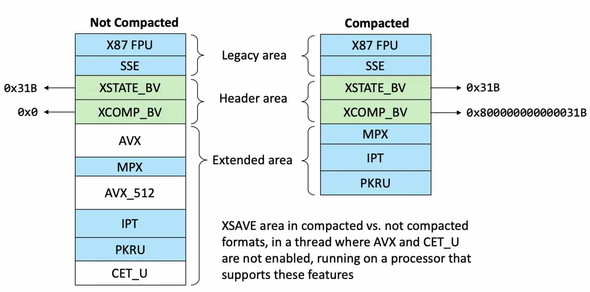
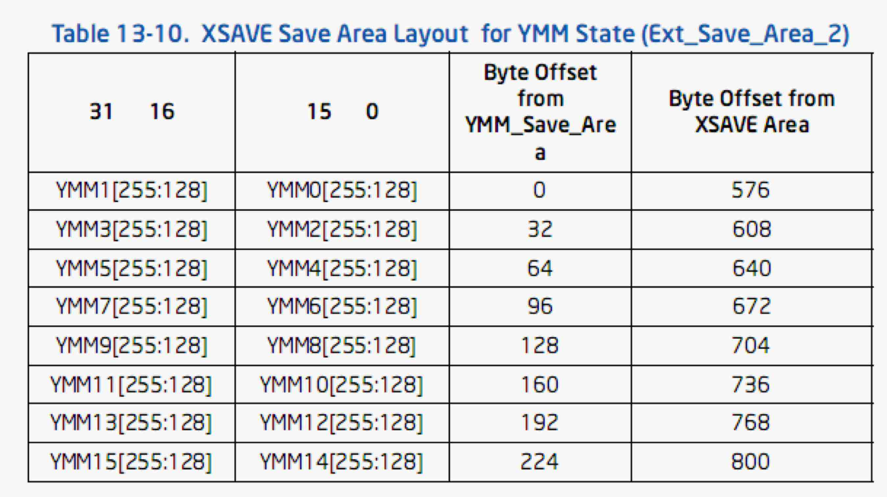

# CPUID 

Intel Software Development Mauanl is your best friend. 

## XSAVE 

<https://windows-internals.com/cet-on-windows/>

<https://www.moritz.systems/blog/how-debuggers-work-getting-and-setting-x86-registers-part-1/>

<https://www.moritz.systems/blog/how-debuggers-work-getting-and-setting-x86-registers-part-2/>

Intel® 64 and IA-32 Architectures Software Developer’s Manual Volume 1 - 13.4 XSAVE area

Intel® 64 and IA-32 Architectures Software Developer’s Manual Volume 3 - 39.7.2.3 XSAVE Area in SSA

### State Component Bitmap 

see Section 13.1 XSAVE-SUPPORTED FEATURES AND STATE-COMPONENT BITMAPS

A **state component represents a single subset of data** that can be saved or restored independently. For example, x86 state component, SEE state component, AVX component. 

The individual state components are controlled via the State Component Bitmap. This bitmap is used by XSAVE to determine which instruction sets to save, and by XRSTOR to determine which to restore (or reset).

- <https://www.moritz.systems/blog/how-debuggers-work-getting-and-setting-x86-registers-part-1/>
- 13.1 XSAVE-SUPPORTED FEATURES AND STATE-COMPONENT BITMAPS

|Bit|Instr. set|User SC (XCR0)|Supervisor SC (IA32_XSS)|Size (bytes)|
|---|---|---|---|---|
|0|x87|x87 state|reserved|512|
|1|SSE|SSE state|reserved|
|2|AVX|YMM_Hi128|reserved|256|
|3|MPX|BNDREGS|reserved|64|
|4|BNDCSR|reserved|16|
|5|AVX-512|opmask|reserved|64|
|6|ZMM_Hi256|reserved|512|
|7|Hi16_ZMM|reserved|1024|
|8|PT|reserved|PT|72|
|9|PKRU|PKRU|reserved|4|
|13|HDC|reserved|HDC|8|

### Legacy Region (512 bytes)

The legacy region comprises x87 state and SSE state. 

#### x87 State

Bytes 159:32 are used for the registers ST0–ST7 (MM0–MM7). Each of the 8 register is allocated a 128-bit region, with the low 80 bits used for the register and the upper 48 bits unused.

#### SSE State 

Intel SDM **13.5.2 SSE State**. 

The XSAVE feature set can operate on SSE state only if the feature set is enabled (CR4.OSXSAVE = 1) and has been configured to manage SSE state (XCR0[1] = 1).

### XSAVE Header (64 bytes)

|64|0|bits|
|---|---|---|
|XCOMP_BV|XSTATE_BV|0|
|reserved|  reserved |128|
| reserved| reserved|256|
| reserved| reserved|384|

- Bytes 7:0 of the XSAVE header is a state-component bitmap (see Section 13.1 XSAVE-SUPPORTED FEATURES AND STATE-COMPONENT BITMAPS) called `XSTATE_BV`
- Bytes 15:8 of the XSAVE header is a state-component bitmap called `XCOMP_BV`.
  - `XCOMP_BV[63]` indicates the format of the extended region of the `XSAVE` area (see Section 13.4.3). If it is clear, the standard format is used. If it is set, the compacted format is used; `XCOMP_BV[62:0]` provide format specifics as specified in Section 13.4.3.
  - `XCOMP_BV[63]` determines which form of the `XRSTOR` instruction is used. If the bit is set, the compacted form is used; otherwise, the standard form is used. See Section 13.8.

### AVX State 

The new state register state added by Intel AVX comprises the upper 128 bits of the registers YMM0–YMM15. These 16 128-bit values are denoted YMM0_H–YMM15_H and are collectively called AVX state.

Note that: 512 (legacy region) + 64 (xsave header) = 576 bytes (byte offset from XSAVE area). 

### MPX State 

