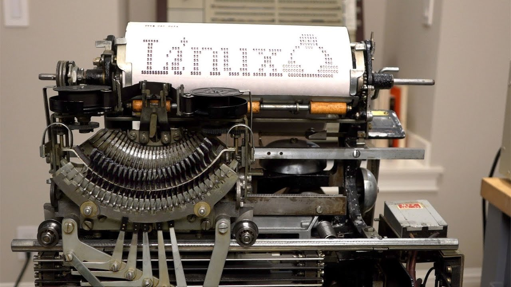
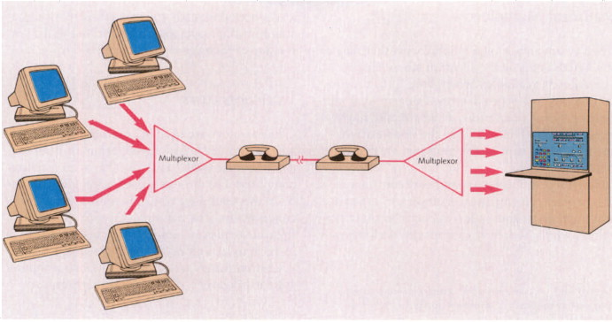
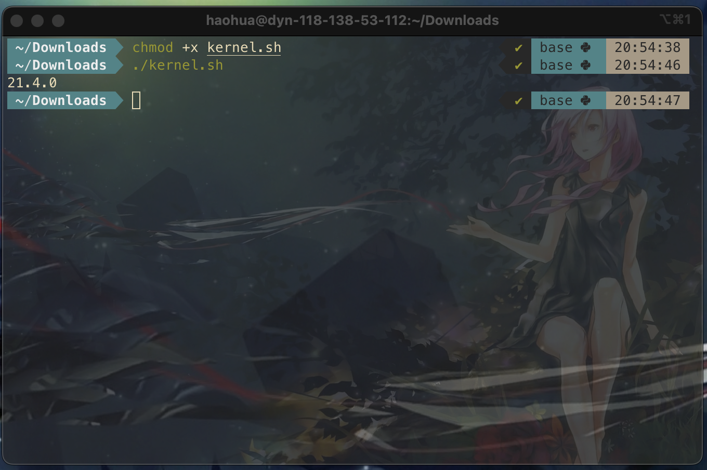
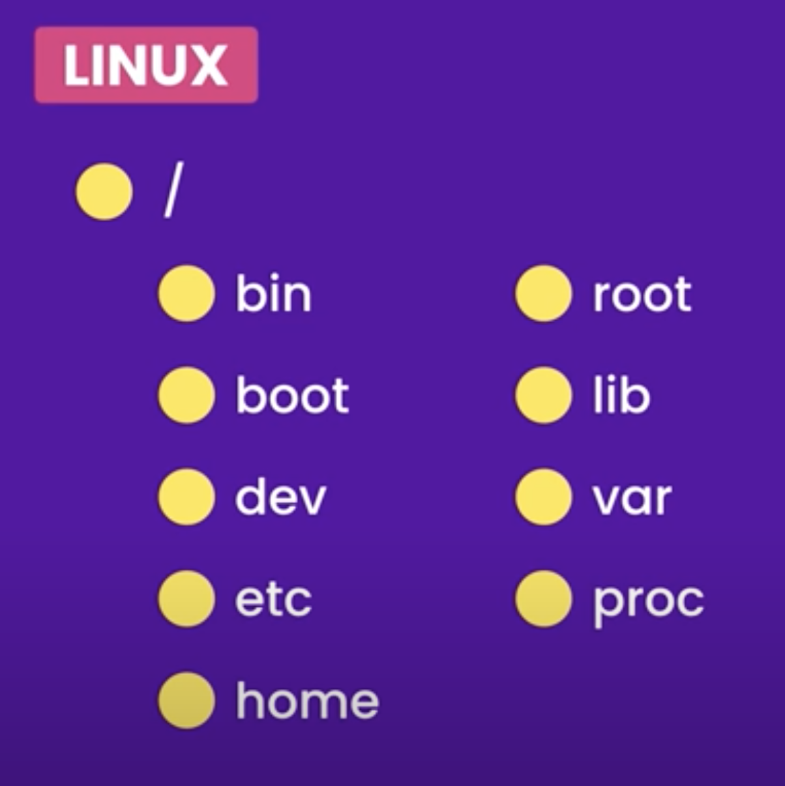

# What is a Terminal ? 

## Terminal/Console/Typewriter

[Terminals, Consoles & Shells Explained... - Sab's Blog (sebastiangogola.com)](https://sebastiangogola.com/terminals-consoles-shells-explained/)

**A teleprinter (teletypewriter, *teletype* or TTY)** is an electromechanical device that can be used to send and receive messages. 

  

From [Using a 1930 Teletype as a Linux Terminal - YouTube](https://www.youtube.com/watch?v=2XLZ4Z8LpEE)

That is what `tty` stands for. 

> In Linux, there is a pseudo-teletype multiplexor which handles the connections from all of the terminal window pseudo-teletypes (PTS).

If you know about how [Graphics card](https://en.wikipedia.org/wiki/Graphics_card) (or Video Graphics Array) works, you will not feel surprised. The screen of the monitor is basically a paper, and the message is printed pixel by pixel on the screen by Linux OS. 

Now you should understand the concept of ***"stream"*** , it is a serial string of bytes/characters (from your keyboard, or the mainframe, think about how a teletype works). 

In conclusion, **Terminal** is a software emulated-teletype, it can send and receive message to/from the mainframe ***(stdin, stdout, stderr)*** . Interestingly, the mainframe can be a local or remote machine. 

- Local : pseudo-teletype **(PTY, PTS, TTY)** 
- Remote : [PuTTY](https://www.ssh.com/ssh/putty/)

## Sesstion 

The connection ***between a terminal and the server is called a sesstion*** (think of a terminal is the client, and the operating system or the desired application is the server. In fact, the client-server model is used more frequently than we though in our computer). 

By typing the `tty` command, we can see which termianl that we are using. 

```
$ tty
/dev/ttys000
```

In Unix/Linux, every thing is a file, including ***devices***. 

A file, is basically ***a serial of bytes*** (you can view the content of a file by hex editor).  

The ***stream***, is also a serial of bytes/characters (we know `char` happens to be a byte since ASCII encoding), but it may with time stamps. 

If you open another terminal, and type `tty` again


Not surprising, right?  

## Terminal Multiplexor

[Home · tmux/tmux Wiki (github.com)](https://github.com/tmux/tmux/wiki)

The concept of "terminal multiplexor" is very strange for us nowadays, becasue we can open any number of new winodws in the GUI. But it is still useful if you connect to a remote server. 

Think about this scenario, you have a huge project in the remote server and the project may take about 10 hours to complete the compilation process. But we still want to do other stuff on the remote server but we can't kill or pause the terminal that running gcc.  

We want to open another terminal which conncects to the same server. 

> Multiplexor is a phsical or virtual device that maintain ***one-to-many communication***
>
> | Dedicated Circuit                                            | Multiplexing                                                 |
> | ------------------------------------------------------------ | ------------------------------------------------------------ |
> |  |  |
>
> From https://www.sciencedirect.com/topics/engineering/multiplexors 

## Shell

[Terminals, Consoles & Shells Explained... - Sab's Blog (sebastiangogola.com)](https://sebastiangogola.com/terminals-consoles-shells-explained/)

***Shell*** is also called a wrapper (like the wrapping paper for chocolate packaging), and the operating system is called ***kernel*** (the core of chocolate!)


From https://stackoverflow.com/questions/5957570/what-is-the-difference-between-the-kernel-space-and-the-user-space

The Shell is the application that can ***handle over the operations to the other desired applications.***

Note that ***most of commands/utilities are not a part of Linux***, they are just small programs/applications developed by the community. For example, you can install MinGW to use Linux commands in Windows and you can also develop your own commands. 

To launch the shell in interactive mode, simply open the terminal 


To run a shell script, give it executable premession `chmod +x show_kernel_version.sh`  and then run it. 

```bash
#!/usr/local/bin/zsh
uname -r
```

The script file `show_kernel_version.sh` (in fact, the extension name is not important, since `#!` token will tell the shell which shell to use). 



This is all about Linux 101. 

Learn more **Linux utilities** by `man` and `--help` or `-h` commands. 

[What's the difference betwen the single dash and double dash flags on shell commands? - Server Fault](https://serverfault.com/questions/387935/whats-the-difference-betwen-the-single-dash-and-double-dash-flags-on-shell-comm)

> A single hyphen can be followed by multiple single-character flags. A double hyphen prefixes a single, multicharacter option.
>
> ```
> tar -h 
> tar --help
> ```

Keep in mind,  **Linux utilities** are not a part of Linux. 

## User and Groups 

> ***NOTE***:
>
> User is not the same concept in 'user space'

- `root` account with the highest privilege, which starts with `#`
- normal user account starts with `$`

```
root:/# 
hello:/$  
```

## File System 

[【Programming with Mosh】Docker Tutorial for Beginners - YouTube](https://www.youtube.com/watch?v=pTFZFxd4hOI)



Keep in mind, 

> ***Everything is a file in Linux*** (including ***running processes***, device, directory, network socket, pipe)

- `/` root directory 
  - `/bin/` binary program 
  - `/boot/` booting 
  - `/dev/` device 
  - `/etc/` editable text configuration 
  - `/root/`  
  - `/home/`
  - `/lib/` system library like glibc
  - `/var/` variables (somethings that are updated frequently, like log file)
  - `/proc/` running processes (Linux abstracts the running processes as files)

## Off the Topic

### Basic Commands

***Docker Tutorial for Beginners***

[Docker Tutorial for Beginners - YouTube](https://www.youtube.com/watch?v=pTFZFxd4hOI)

<iframe width="560" height="315" src="https://www.youtube.com/embed/pTFZFxd4hOI?start=1789" title="YouTube video player" frameborder="0" allow="accelerometer; autoplay; clipboard-write; encrypted-media; gyroscope; picture-in-picture" allowfullscreen></iframe>

The current working directory

```bash
pwd
```

### Text 

- vim 
- cat 
- less 
- head
- tail 

#### Redirect stdio and stdout

[Docker Tutorial for Beginners - YouTube](https://www.youtube.com/watch?v=pTFZFxd4hOI)

[bash - What does the < (left chevron / triangle bracket) do? - Unix & Linux Stack Exchange](https://unix.stackexchange.com/questions/283374/what-does-the-left-chevron-triangle-bracket-do)

```
grep "something" < /path/to/input.file > /path/to/output.file 
```

#### Pipe 

[Piping in Unix or Linux - GeeksforGeeks](https://www.geeksforgeeks.org/piping-in-unix-or-linux/)

### Package Manager 

When you install a new software, the package manager will first search the name in the local database and then pull the software from the remote server. 

In docker, you may encounter an error while installing `nano`

```bash
apt install vim
```


It seems to be impossible. https://www.youtube.com/watch?v=pTFZFxd4hOI

But this error teaches us how the package manager works. 

To solve the problem, we need to first update the ***local database*** 

```
apt update
```

For more details, read https://wiki.debian.org/SourcesList and open `/etc/apt/sources.list` . 

